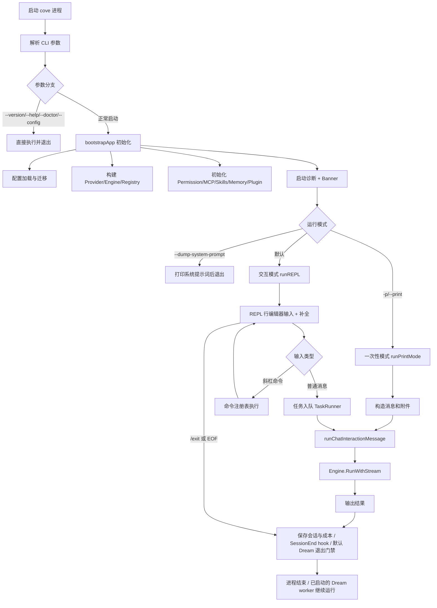
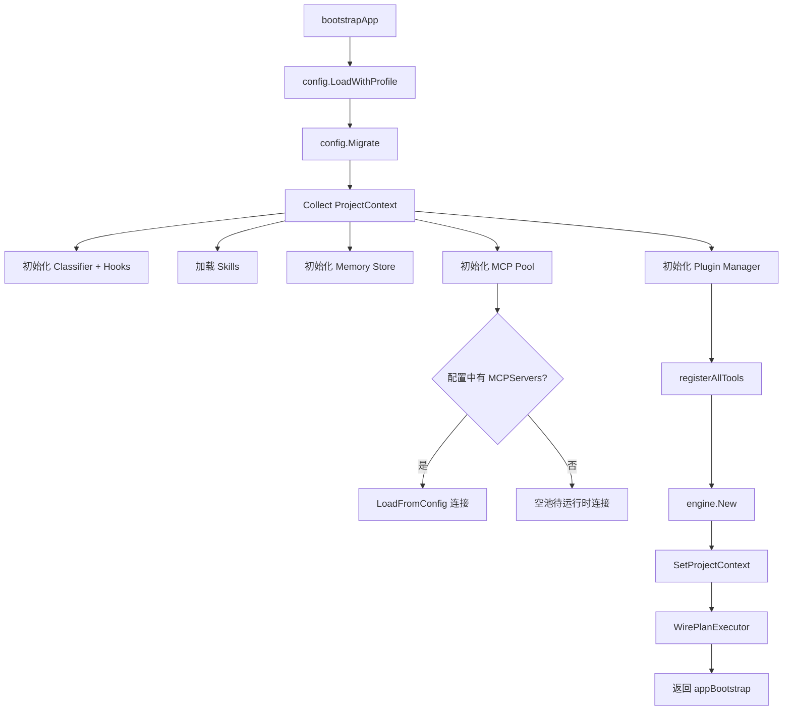
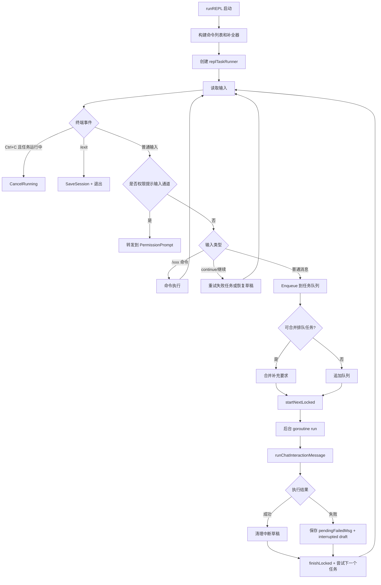
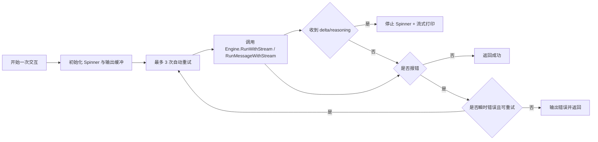
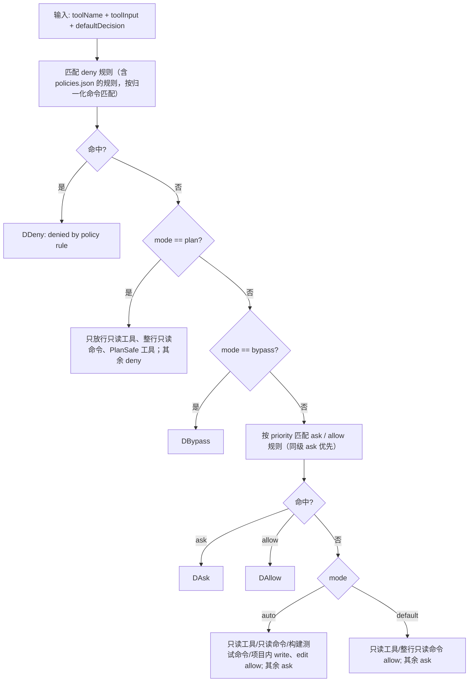
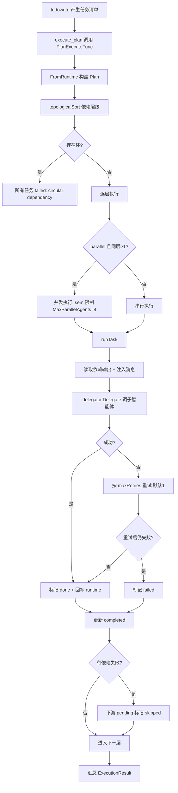
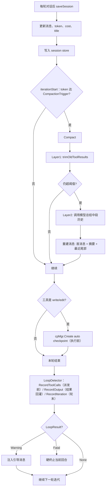
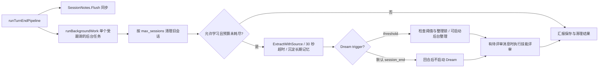

# Cove 全流程图（总览 + 模块内细化）

说明：本文件在端到端总流程基础上，补充各大模块内部运作流程，便于做技术展示与系统讲解。

## 1) 端到端总流程（保留总览）



## 2) 启动与初始化流程（bootstrapApp）



## 3) REPL 主循环与异步任务队列



## 4) 交互层流程（runChatInteractionMessage）



## 5) 引擎回合主流程（Engine.RunMessageWithStream，internal/engine/turn_loop.go）

```mermaid
flowchart TD
    A[接收用户消息] --> B[写入 messages，建检查点基线]
    B --> C[构建 SystemPrompt: tools/skills/memory/context/拆任务引导]
    C --> D["iterationStart：预算与轮次上限检查<br/>token 达 CompactionTrigger 时压缩历史"]
    D --> E[callModel：按路由选模型，流式输出]
    E --> F{响应类型}
    F -->|纯文本| G[finishOrNudge]
    F -->|带 tool calls| H[dispatchTools：并发安全工具并行(上限8)，write/edit 按路径认领，其余串行]
    H --> I[executeTool（见 §6）]
    I --> J[afterIteration：结果回灌、LoopDetector.RecordIteration、断路器与模型升级]
    J --> D

    G --> G1{完成校验门禁 / 自审 / todo 提醒 / 停止提示?}
    G1 -->|需继续| D
    G1 -->|完成| L[saveSession + cost/ratelimit 更新 + 验收证据落盘]
    L --> M[runTurnEndPipeline（见 §12）]
    M --> N[返回最终文本]
```

## 6) 单次工具执行内部流程（executeTool，internal/engine/engine.go）

```mermaid
flowchart TD
    A[按名称查找 Tool] --> B{存在?}
    B -->|否| B1[返回 unknown tool]
    B -->|是| C[BeforeTool hook]
    C --> D[Guardrail.BeforeCall]
    D --> D1{Block?}
    D1 -->|是| D2[返回阻断错误]
    D1 -->|否| E[write/edit：先建自动检查点]
    E --> F[构造 tool.Context]
    F --> G{shell 分类器}
    G -->|灾难命令| G1[硬拦截]
    G -->|通过| H[Validate 输入]
    H --> I[authorizeToolCall：Tool.CheckPermissions → plan 门禁 → permission.Manager.Check（见 §7）]
    I --> J{allow/ask/deny/bypass}
    J -->|deny| J1[返回拒绝]
    J -->|ask| J2["授权提示 [y] 允许 [a] 本会话记住 [p] 本项目记住 [n] 拒绝 [e] 拒绝并说明"]
    J2 -->|拒绝| J3[返回拒绝（带理由时回传 user rejected: 理由）]
    J2 -->|允许| K[t.Call]
    J -->|allow/bypass| K
    K --> N{执行错误?}
    N -->|瞬时错误| N1[重试一次]
    N -->|仍失败| N2[Guardrail.AfterCall(error) + 返回错误]
    N -->|否| O[Guardrail.AfterCall(success)]
    N1 --> O
    O --> P[AfterTool hook + trackFileChanges + 输出裁剪 + LoopDetector.RecordOutput + 条件技能注入 + 子目录提示]
    P --> Q[返回结果给模型]
```

## 7) 权限系统内部决策流程（permission.Manager.Check，internal/permission/permission.go）



## 8) 计划执行器内部流程（execute_plan / plan executor）



## 9) MCP 与插件模块流程

### 9.1 MCP 命令侧流程（/mcp）

```mermaid
flowchart LR
    A[/mcp action] --> B{action}
    B -->|list| C[列 AllServers]
    B -->|connect| D[从配置取 server 并 Connect]
    B -->|disconnect| E[Disconnect 或 DisconnectAll]
    B -->|read| F[ReadResource 输出内容块]
```

### 9.2 MCP 工具侧流程（tool: mcp / mcp_resources / mcp_read_resource）

```mermaid
flowchart TD
    A[模型发起 mcp 工具调用] --> B[Permission: Asked]
    B --> C{批准?}
    C -->|否| C1[返回权限拒绝]
    C -->|是| D[pool.CallTool(server, tool, args)]
    D --> E[拼接 content/text]
    E --> F[返回模型]
```

### 9.3 插件管理流程（/plugin）

```mermaid
flowchart TD
    A[/plugin action] --> B{action}
    B -->|list| C[Refresh + AllPlugins]
    B -->|install| D[MarketplaceInstall 或 Install(name,url)]
    B -->|enable/disable| E[切换状态]
    B -->|uninstall| F[卸载]
    B -->|search/refresh/update| G[市场索引与更新]
```

## 10) 会话、压缩、检查点、检测流程



## 11) 三层循环检测流程 (LoopDetector，internal/engine/loopdetect.go)

```mermaid
flowchart TD
    A[RecordToolCalls(fingerprint) / RecordOutput(output) / RecordIteration()] --> B{只读工具?}
    B -->|是 read/grep/glob 等| C[跳过检测]
    B -->|否| D[Layer1a: 精确指纹匹配]

    D --> E[sha256(toolName+input) 入 14 轮窗口]
    E --> F{相同指纹 ≥10 次?}
    F -->|是| G[Warning]
    F -->|否| H[Layer1b: 工具名匹配（toolOnlyWindow）]

    H --> I[工具名入 12 轮窗口]
    I --> J{相同工具名 ≥10 次?}
    J -->|是| G
    J -->|否| K[Layer2: 输出哈希匹配]

    K --> L[sha256(output 前 512 字节) 入 40 轮窗口]
    L --> M{相同哈希 ≥8 次?}
    M -->|是| G
    M -->|否| N[Layer3: 停滞检测（stallThresh）]

    N --> O{连续 60 轮无文件读写?}
    O -->|是| G
    O -->|否| P[返回 None]

    G --> Q{breakCount < 上限?}
    Q -->|是| R[注入引导 + 清空窗口 + 返回 Warning]
    Q -->|否| S[返回 Fatal 硬终止]
```

另：模型故障回退不是跨 provider 的 ModelFallback（`api.ModelFallback` 没有调用方），而是 `fallbackModel()` 在 `model` 与 `model_fast` 之间切换：快速模型连续失败时本轮改用高级模型。

## 12) 回合后自学习流水线（runTurnEndPipeline）



`--no-auto` 或本地 provider 会关闭回合后的自动学习，但不关闭会话保存、笔记和旧会话清理。默认 `session_end` 模式由 CLI 退出路径在 SessionEnd hook 后检查 Dream 门禁，满足条件时启动独立 worker；`--no-auto` 会跳过。`WaitBackground` 等待提取与清理，不等待技能评审或独立 Dream 整理。

## 13) 代码锚点（定位）

- 启动入口：[cli/cove/main.go](../cli/cove/main.go)
- 应用初始化：[cli/cove/app_bootstrap.go](../cli/cove/app_bootstrap.go)
- REPL 主循环：[cli/cove/repl_loop.go](../cli/cove/repl_loop.go)
- TaskRunner：[cli/cove/repl_tasks.go](../cli/cove/repl_tasks.go)（`replTaskRunner`）
- 交互与重试：[cli/cove/chat_interaction.go](../cli/cove/chat_interaction.go)
- 引擎回合主循环：[internal/engine/turn_loop.go](../internal/engine/turn_loop.go)（`RunMessageWithStream`、`iterationStart`、`callModel`、`finishOrNudge`、`afterIteration`）
- 工具执行与授权链：[internal/engine/engine.go](../internal/engine/engine.go)（`executeTool`、`authorizeToolCall`、`planModeGate`）
- 回合后后台任务：[internal/engine/background.go](../internal/engine/background.go)
- 退出整理入口：[cli/cove/session_end.go](../cli/cove/session_end.go)
- 授权提示与确认框：[cli/cove/permission_prompt.go](../cli/cove/permission_prompt.go)、[cli/cove/confirm.go](../cli/cove/confirm.go)
- 权限系统：[internal/permission/permission.go](../internal/permission/permission.go)
- 循环检测：[internal/engine/loopdetect.go](../internal/engine/loopdetect.go)
- 计划执行器：[internal/plan/executor.go](../internal/plan/executor.go)
- MCP 工具桥接：[internal/tool/mcp_tool.go](../internal/tool/mcp_tool.go)
- 插件与 MCP 命令：[internal/command/commands_integrations.go](../internal/command/commands_integrations.go)
